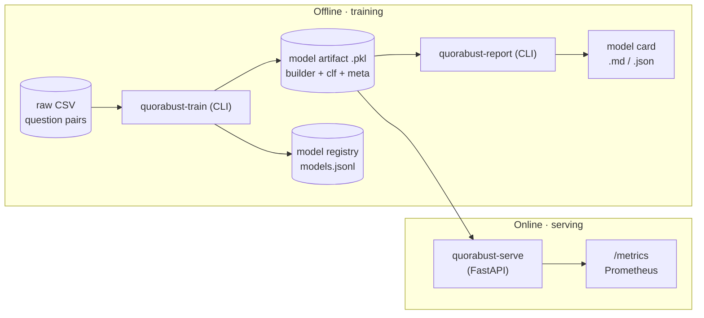
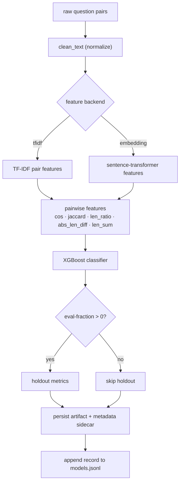
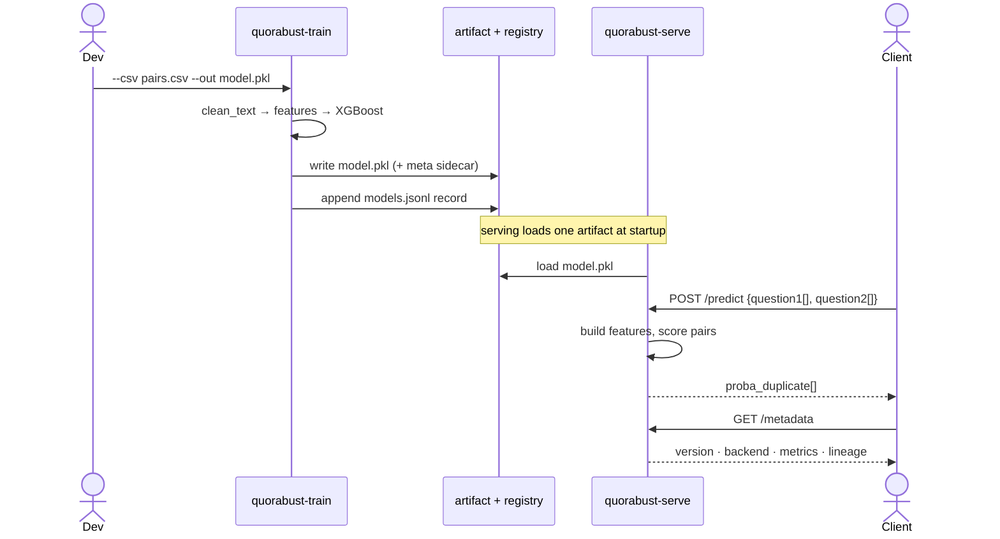
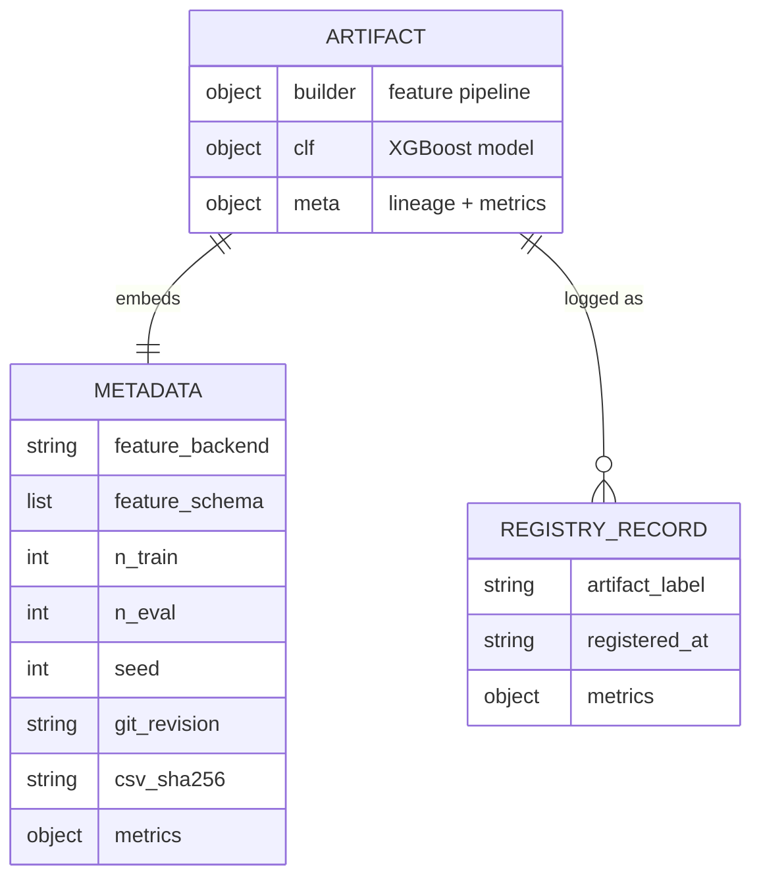

# Architecture

Quorabust separates **training** (offline, reproducible, lineage-tracked) from
**serving** (a stateless FastAPI app), with a versioned **artifact contract** in
between. The diagrams below are the fastest way to understand the system; prose
follows.

## Component overview

## Training pipeline

## Train vs. serve

## Artifact + registry contract

## Why it's shaped this way

- **Reproducible training.** Every artifact embeds its lineage — feature backend,
  feature schema, training size, seed, source-CSV checksum, and git revision — so a
  reviewer can tell exactly what produced a model without loading the pickle (a JSON
  sidecar carries the same metadata). See [REPORTING.md](REPORTING.md).
- **Stateless serving.** `quorabust-serve` loads one artifact at startup and exposes
  `/predict`, a safe `/metadata` view (no local paths), `/health`, `/ready`, and
  `/metrics`. Nothing is written at request time, so it scales horizontally.
- **Honest evaluation.** Holdout metrics and threshold sweeps are generated by
  `quorabust-report` into a model card; the checked-in
  [SAMPLE_MODEL_CARD.md](SAMPLE_MODEL_CARD.md) is built from synthetic smoke data and is
  explicitly not a benchmark.

## Where to look next

- [REPORTING.md](REPORTING.md) — model cards, metrics, and reproducing real numbers.
- [SCALING.md](SCALING.md) — batching, caching, and serving under load.
- [ENTERPRISE.md](ENTERPRISE.md) — A/B routing, drift checks, and operational notes.
